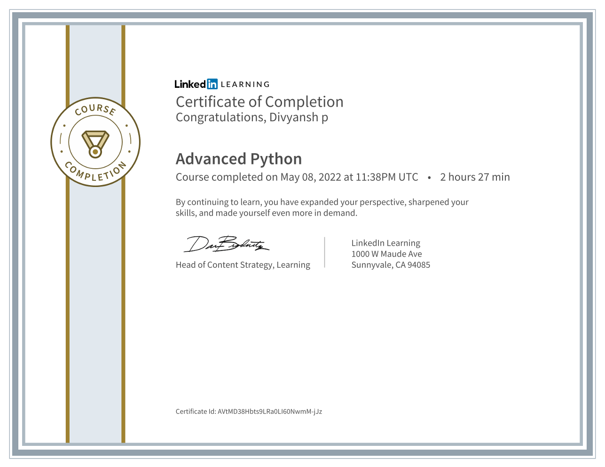
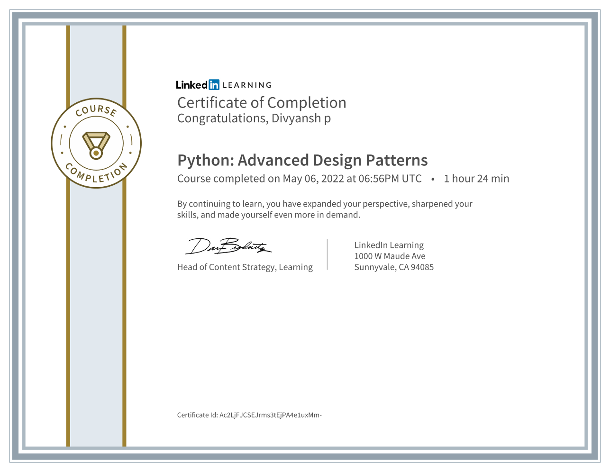

I’m living the dream.

I’ve always been a great problem solver, an independent introvert, and a technophile obsessed with the latest devices. Today, I’m working from home as a software developer for JobTarget, Inc., and I get to show off all these elements of who I am.

I started learning to code when I was a teenager, though it was always more of a hobby than a career focus. After a college education in Engineering, and continuing to pursue that hobby, I realized Computer Science was the right field for me.

Since then, I’ve worked on countless freelance projects and have been involved with a handful of notable startups. Today, I’m working as a junior developer with the amazing team at JobTarget, Inc., and am getting into Cloud and data science on my own time.

I’m familiar with a variety of programming languages and technologies, including Python, C, C++, SQL, AWS, Serverless Framework but I’m always adding new skills to my repertoire. I’m also eager to meet other software engineers in the area, so feel free to connect!

# Certified Courses
**Learning Platform  :** `LinkedIn-Learning` `Udemy` 
|       |         |         |
|-------|---------|---------|
| |  |  |
| | |

