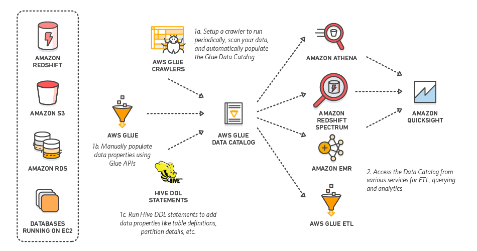
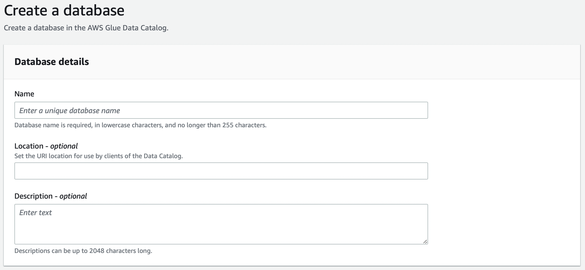
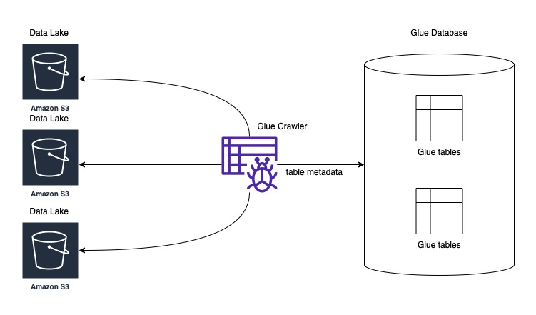
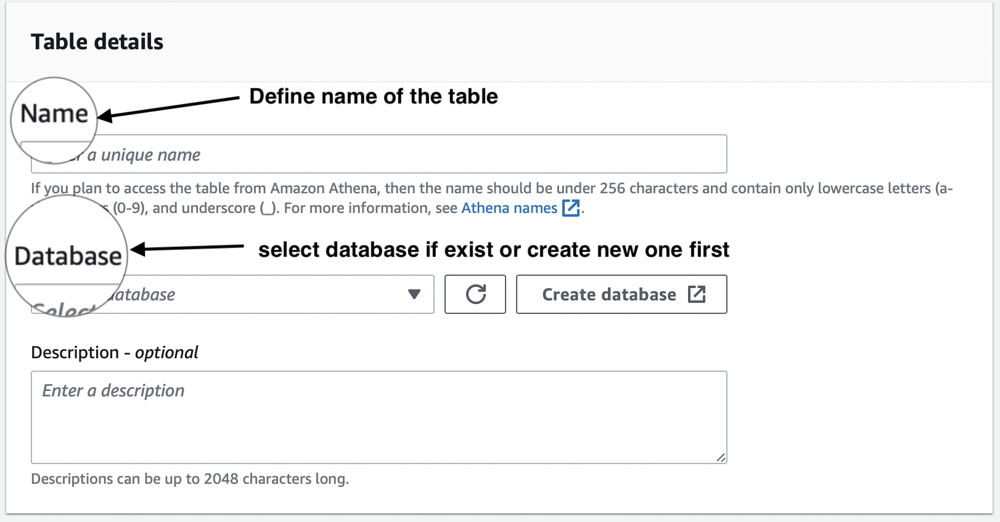
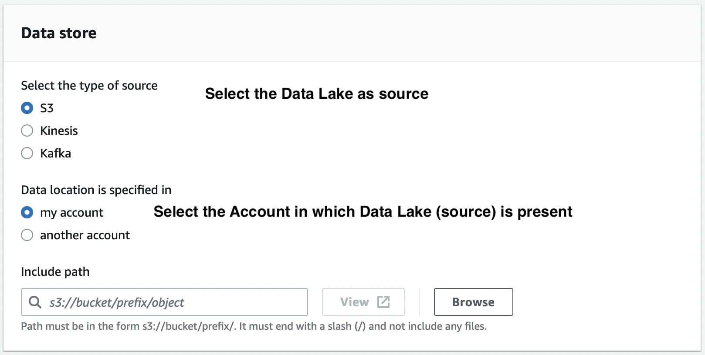
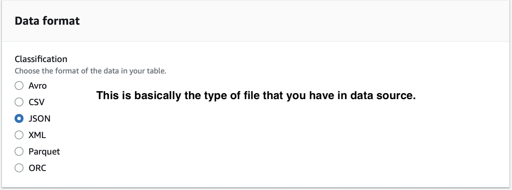
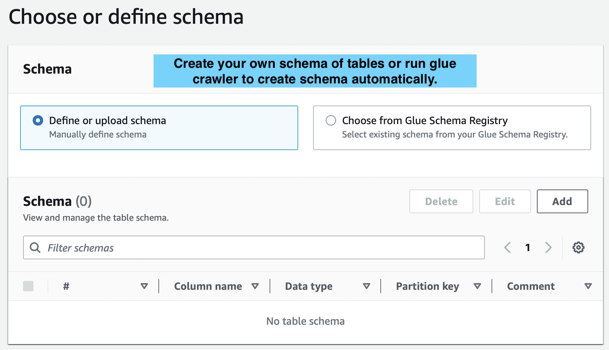
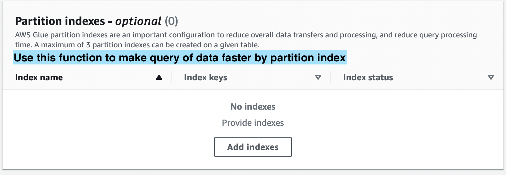

<!--more-->



In this section we will be looking at Database in AWS Glue service. \
**Data catalog:** Metadata and the structure of the data is stored in Data Catalog. \
**Database:** It is used to create or access the database for the sources and targets. \
**Table:** Create one or more tables in the database that can be used by the source and target.

---

# Database
## Configuration (Web Console)



`Name` **Required** : Name of the database. \
`Location` **Optional**:  Uniform resource identifier (uri) of data catlog which can be used by client. \
`Description` **Optional**: Description of the database.

---

## Configuration (serverless)

### Prerequisites
**Note:** Please run this command to set AWS credentials in Serverless framework.
```
serverless config credentials --provider aws --key <KEY> --secret <SECRET_KEY> -o
```
Following should be added in to `.env` file in same directory as `serverless.yml` file.
``` 
SERVICE_NAME=glue-database
```
Serverless Code 
``` yaml

service: ${env:SERVICE_NAME}
frameworkVersion: '3'
useDotenv: true

provider:
  name: aws

resources: # CloudFormation template syntax
  Resources:
    GlueDatabase:
      Type: AWS::Glue::Database
      Properties: 
        CatalogId: ${aws:accountId}   # serverless inbuild ENV variable
        DatabaseInput: 
          Description: "description here"
          # LocationUri: String   #Optional
          Name: test_databavse
```
Command to run serverless file (please run from same directory as serverless.yml)
```
 serverless deploy
 ```


Change `serverless` to `sls` in windows path variables to make deployment command easier.


---

# Tables

{{< style "img { height: 19.25rem; }" >}}   

The metadata definition for the data in a data store is a table in the AWS Glue Data Catalog. You can manually create a table in the AWS Glue console or generate a table when you run a crawler. The values of your table's metadata are shown in the Tables list in the AWS Glue console. When you develop ETL (extract, transform, and load) jobs, you use table definitions to identify sources and targets.

## Configuration (Web Console)





If the Data source is in another account, you might need to give cross account permission.





