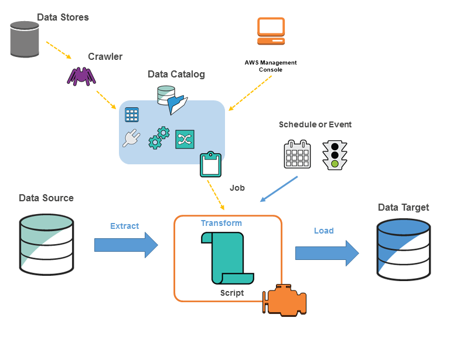

<!--more-->

# AWS Glue (Introduction)

AWS Glue is a fully managed ETL (Extract Transform and Load) service offered by AWS on cloud. AWS is powerfull tool as it is based on distrubuted framework.

AWS Glue consists of three major components as shown below.


graph TD
    A[AWS Glue]
    A --> B[Central metadata repository]
    A --> C[ETL engine]
    A --> D[Flexible scheduler]           


**Meta Data Repository** : Meta data repo will not store raw datas in it but instead it stores schema and other metadata related to the structure of data which is stored in Databases such as S3, DynamoDB etc. For example :


graph LR 
    A[(S3 Database)]
    A--->|run glue crawler|B[Glue Database]


**ETL Engine** : ETL engine is used for Extracting data from a source and perform different types of transform function on data and finaly load data into data warehouse or any database as per preferance. 

**Flexible scheduler** : This allows ETL jobs to be scheduled on CRON.

## AWS Glue services 

There are many different services under AWS Glue. Naming and ordering of services might change in future. 

- Data Catalog
  - Databases
    - Tables
  - Stream schema registries
    - Schemas
  - Connections
  - Crawlers
    - Classifiers
  - Catalog settings
- Data Integration and ETL
  - AWS Glue Studio
    - Jobs
  - Interactive Sessions
    - Notebooks
  - Data classification tools
    - Sensitive data detection
    - Record Matching
  - Triggers
  - Workflows
    - Blueprints
  - Security configurations


[AWS Glue Official Documentation](https://docs.aws.amazon.com/glue/index.html)


